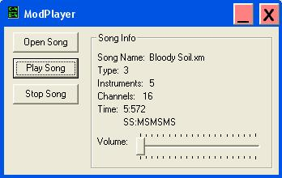



## Mod Player

### Description

This program plays module(mod) sound files. it supports *.xm *.it *.s3m and *.mod modules. This code uses fmod.dll(www.fmod.org).
 
### More Info
 
A module sound file.

You should put the fmod.dll included in the system32 directory of your computer as it uses fmod declare functions.

Sound out of your speakers.

             |
---                |---
**Submitted On**   |2006-11-25 14:47:54
**By**             |[Eric mrE521](https://github.com/Planet-Source-Code/PSCIndex/blob/master/ByAuthor/eric-mre521.md)
**Level**          |Intermediate
**User Rating**    |5.0 (10 globes from 2 users)
**Compatibility**  |VB 4\.0 \(32\-bit\), VB 5\.0, VB 6\.0
**Category**       |[Sound/MP3](https://github.com/Planet-Source-Code/PSCIndex/blob/master/ByCategory/sound-mp3__1-45.md)
**World**          |[Visual Basic](https://github.com/Planet-Source-Code/PSCIndex/blob/master/ByWorld/visual-basic.md)
**Archive File**   |[Mod\_Player20330311252006\.zip](https://github.com/Planet-Source-Code/eric-mre521-mod-player__1-67179/archive/master.zip)

